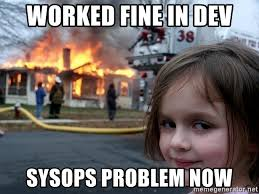
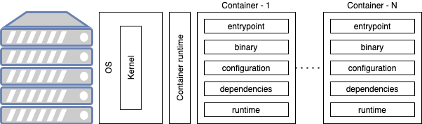
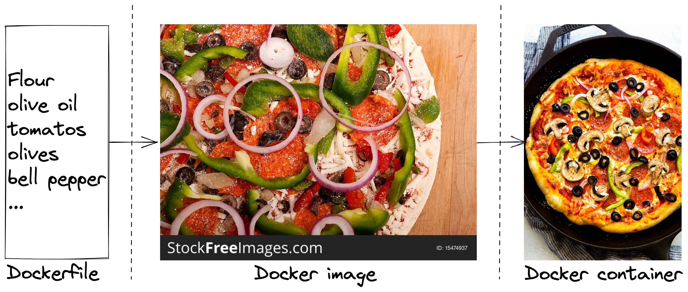

<!-- _class: lead -->

# Understanding Containers

---

# Discussed topics

* Classic deployments
* Classic deployments limits
* Containers
* Docker
* Guidelines & best practices

---

<!-- _class: lead -->
# Classic Deployments

---

> In a simplified way, a deployment is the setup of a **target infrastructure** so that it hosts **necessary layers** for the application to **function properly**.

---

# Deployment components (1/2)

Many layers are involved in the deployment of an application. Some of these layers are related to the host machine:

<br/><br/>

| Layer                                                  | Comment                                                                                                                      |
| -------------------------------------------------------- | --------------------------------------------------------------------------------------------------------------------------------- |
| Operating system                                | ubuntu, centos, windows, etc                                                           |
| Execution runtime                 | For instance the suitable JRE version for a Java application                                                   |

---

# Deployment layers (2/2)

Other layers are related to the application itself

<br/><br/>

| Layer                                                  | Comment                                                                                                                      |
| -------------------------------------------------------- | --------------------------------------------------------------------------------------------------------------------------------- |
| Start/stop scripts | Utility scripts used to start and stop the application                                                   |
| Configuration files                      | For instance the url of the database may vary based on the environment |
| Binary                                 | For instance, for a java application it is the jar or war file                |

---

# OS based deployments (1/2)

A possible approach to deployments would be:

* Create **one big** instance with a given os (Ubuntu for example)
* Host multiple applications on this same instance

<br/><br/>


---

# OS based deployments (2/2)

* What to do if two applications need **different** runtime **versions** ?
* What to do when an application is **malfunctioning** and using all the resource on the machine ?
* What to do when an application has an **exploit**?
* How to reproduce the exact **same** conditions in **different** environments ?

---

# Dedicated host deployments (1/2)

Another possible approach to deployments would be:

* Create **multiple small** instances
* Deploy an application per instance

<br/><br/>


---

# Dedicated host deployments (2/2)

* How to handle OS upgrades and **security** patches ?
* How to handle non linear **resources consumption** ?

<br/><br/>



---

<!-- _class: lead -->
# Classic Deployments Limits

---

# Limits per deployment model

<br/>
<br/>

| 1 machine = <br/>N applications        | 1 machine = 1 application           |
|-------------|--------------|
| **Poor isolation**<br/><br/>**Poor reproducibility**: in case of neighbour applications not being the same accross environments|**Poor resources usage**<br/><br/>**Poor maintainability**: in case of lack of automation|

---

<!-- _class: lead -->
# Containers

---

> **Containers** can be viewed as a **lightweigh**, **isolated unit** containing an application alongside its dependencies and configuration.

> **Containers** run in a **container runtime** such as **docker** or **containerd**.

> **Containers** use the host machines **kernel** instead of embedding a **whole OS**.

---

# Container components

A container can be represented as follows:

<br/><br/>



---

# Container characteristics

* **Stateless** - lifecycle of components of the container such as processes, files and environment variables are discarded once the container is dead.
* **Volatile** - containers are expected to have a limited life spawn and can die and restart at any time.
* **Lightweight** - containers use the kernel of the host machine instead of a full OS. This makes them start and stop faster than an actual virtual machine (VM).
* **Portable** - containers can be easily moved from a host machine to another.

---

# Ports and Volumes

* Container **ports** are **not exposed** by default to the host machine.
  * For instance, an application running on port 8080 inside the container might not be accessible from the host.
* Host/container **port isolation** can be broken using explicit **port mapping**.
  * For instance, using **docker** we specify `-p machineport:containerport`.
* Container **filesystem** is **not exposed** by default to the host machine.
  * For instance, if a container creates a file `file.txt`. The file exists inside the container and is lost once the container is deleted.
* Host/container **filesystem isolation** can be broken using **volume sharing**.
    * For instance, using **docker** we specify `-v machinepath:containerpath`.

---

# Containers and deployments

Since containers are isolated, we are able to deploy on a single host:

- **Multiple** environments of the **same** application.
- **Multiple** versions of the **same** application.
- **Multiple** applications requesting **different** version of the dependency.
- **Multiple** applications that use the **same** port.


---

<!-- _class: lead -->
# Docker

---

> **Docker** is an open source platform that enables developers to **build**, **deploy**, **run**, **update** and **manage** containers.

> When talking about **docker** it is important to be able to tell the difference between **dockerfiles**, docker **images** and docker **containers**.

---

# Dockerfile vs image vs container



---

# Dockerfile

* When baking a pizza, you need a recipe explaining what should be done in order to build your pizza.
* **dockerfiles** work the same for docker **containers**.
* A **dockefile** looks like this:

    ```dockerfile
    # Start from python image
    FROM python:3.7-slim       
    # Copy script 'main.py' from machine to '/  app/bin' inside the container
    COPY main.py /app/bin             
    # Tell container to run '/app/bin/main.py'  when it is started
    CMD ["python", "/app/bin/main.py"]
    ```

---

# Image

* Once you have followed the pizza recipe, you should have a raw pizza that is not edible yet but ready to go to the oven.
* **Images** work the same for docker **containers**.
* **Each** instruction from the **dockerfile** creates a new **intermediate image** which is the **last** built image on which we **applied** the **instruction**.
* To build an **image** from a **dockerfile**
    ```console
    docker build -f dockerfile-name -t my-image-name:my-version .
    ```

---

# Container

* Your pizza is now out of the oven
  * It is edible. 
  * Can still be customized compared to the non baked version.
* **Containers** work the same for **docker**.
  * **Containers** are the **final** product.
  * **Containers** built from the **same** image can be customized in a few ways.
  * For instance, **environment variables** can be **overriden** on **startup** as follows
    ```console
    docker run -e CONF="preprod" myimagename:0.0.1
    ```
  * **Startup** command can also be **overriden**
    ```console
    docker run myimagename:0.0.1 my_command
    ```

---

<!-- _class: lead -->
# Docker best practices

---

# Embrace container characteristics

Remember that:

* Containers can be **restarted** or **killed** at any given moment.
    * Containers should be **stateless** - Use an **external managed** database or cloud **database service** for data storage.
    * Containers should be **Fast** - **Reduce** application **startup** time as much as possible.
* Containers are built in **incremental** manner
  * **Base image** should be as **small** as possible
  * **Stable** layers **first** so that the following layers can use the **cache**
  * **Removing** something creates a **new layer**, it does **not delete** the previous layer in which the element existed.
