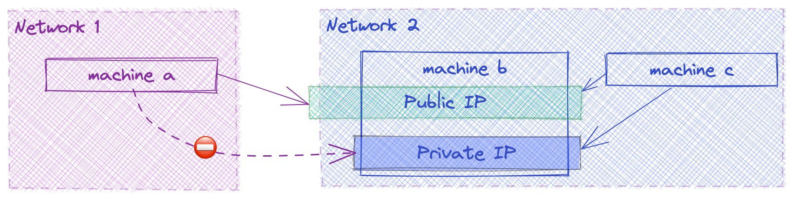
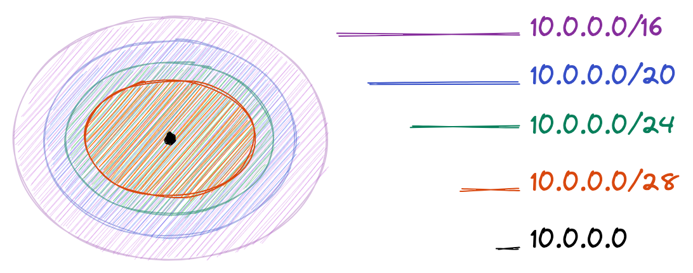
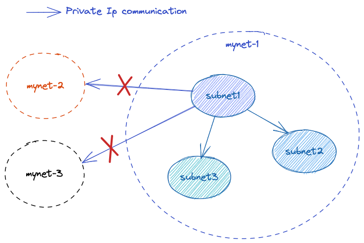
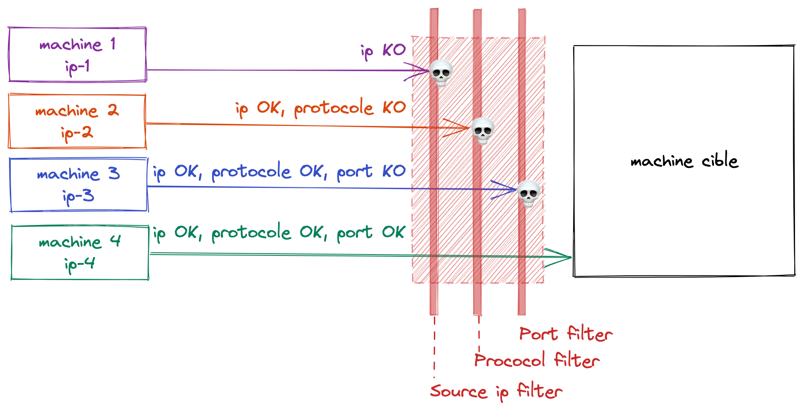
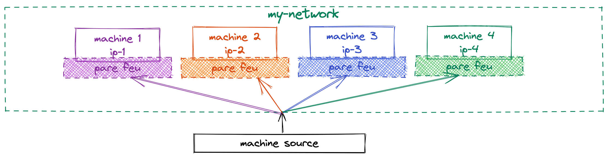
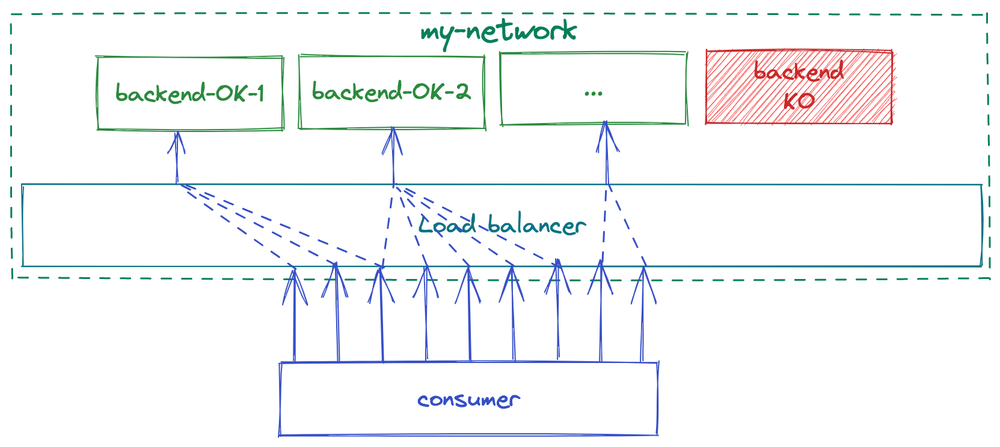
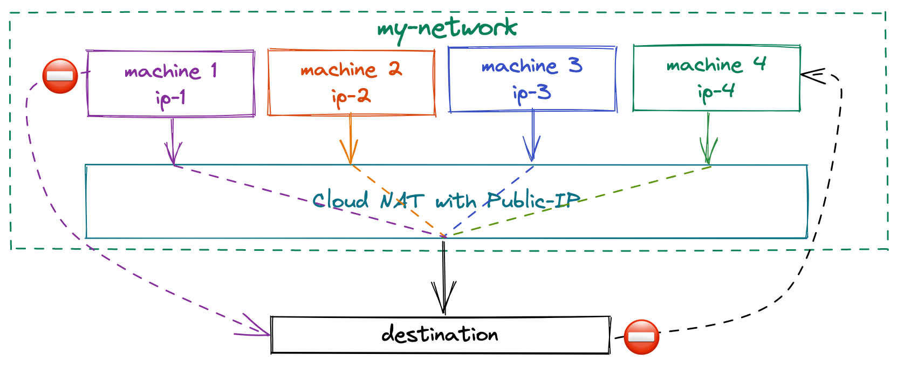
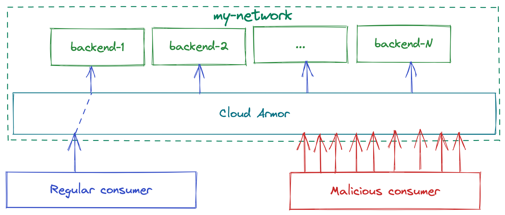

<!-- _class: lead -->

# Google Cloud Networking

---

# Discussed topics

* Public & private IPs
* Subnets & Netmasks
* Google Cloud VPC
* Google Cloud firewall
* Load balancer
* Cloud NAT
* Cloud Armor

---

<!-- _class: lead -->
# Public & Private IPs

---

## Public IPs

* **Public** IPs are equivalents of postal addresses for computer networks:

  * **Fully** qualified
  * **Independant** from the context
  * Globally **unique**

* Finding the public IP can be done by the command:

  ```console
  $ curl "ifconfig.me"
  ```

---

## Private IPs

* **Private** IPs are similar to appartment numbers or addresses without the zip code:

  * Appartment numbers are usefull if already in the building = **Context is needed** for the **private** address to be useful
  * The same postal address exists in multiple towns = **Private** IPs are **not** globally **unique**

* In GCP, the **context** needed to resolve the private addresses is the **network**. 

---
## Public vs Private IPs



---

<!-- _class: lead -->
# Subnets & Netmasks

---

## Subnets

* **Sub-Networks** are defined using a range of IP addresses.
* The **range** is defined through a **CIDR** notation that looks like `a.b.c.d/N`. For instance `10.0.0.0/28`
  
  * `10.0.0.0` is the **first** address in the range
  * `/28` is the **netmask** which defines the **size** of the range
  * `2^(32-netmask)` is the **size** of the range
  * `2^(32-28) = 2^4 = 16` so

    * **First IP** = `10.0.0.0`
    * **Last IP** = `10.0.0.15`

Hint: https://www.ipaddressguide.com/cidr

---

## Special addresses

* For any **subnet**, the following addresses are reserved

  * The **first** IP which **identifies** the **subnet** itself
  * The **last** IP which is used to **broadcast** messages to **all devices** in the **subnet**

* The real allocatable range of IPs is `2^(32-netmask) - 2` (subnet address & broadcast address)
* The following **ranges** are **reserved** for **private IPs**

  * `192.168.0.0/16` = `192.168.0.0 – 192.168.255.255`
  * `172.16.0.0/12` = `172.16.0.0 – 172.31.255.255`
  * `10.0.0.0/8` = `10.0.0.0 – 10.255.255.255`

---

## Subnets && Netmasks



---

<!-- _class: lead -->
# Google Cloud VPC

---

## Virtual private clouds

In **GCP**

* **Networks** are called **Google Cloud VPC** (Virtual Private Cloud) 
* a **VPC** is defined as the **addition** of all **subnets** attached to it

* **Natively** a device can access another **through private IP**

  * If the devices are in the same **subnet**
  * If the devices are in the same **network**

* **Natively** a device can access another **through public IP** with **no regards to networks**

---

## Subnet communication



---

<!-- _class: lead -->
# Google Cloud firewall

---

## Google Cloud firewall

* **Firewalls allow** or **block** network traffic based on **rules**
* **Rules** are defined based on

  * **Source**: **IP** of the **device** from which the traffic is coming
  * **Protocol**: Protocol used by the **source device**
  * **Port**:  Port **targeted** by the **source device**

---

## Filtering traffic



---

## Distributed firewall

In **GCP**, firewalls are distributed which means that the **rules** are **evaluated** at the **device level** & **not** on the **network level**.



---

<!-- _class: lead -->
# Load balancer 

---

## Load balancer

* **Load balancers** are **network services** placed **in front** of devices called **backends**
* Load balancers **redirect traffic** to the backends
* Example usecases include:
  * **Scaling**: backend number can **scale** as needed & the load balancer will **redirect traffic** to **healthy** backends **only**.
  * **IP whitelist**: backend **IPs** can **change**, backends can even have **private IPs only** & yet customers can keep calling the **same load balancer IP**.
  * **Resiliency**: Load balancers **tolerate** more **stress** than regular backends, in case of **peak** in traffic, they will **absorb** the charge.

---

## Health check



---

<!-- _class: lead -->
# Cloud NAT

---

## Cloud NAT

* In **GCP**, Cloud NAT handles **traffic** originating **from** resources **inside** google cloud.
* When **using cloud NAT**, machines with a **private IP only**, can still **access internet** resources.
* When **using cloud NAT**, the internal **system complexity is hidden** from the outside, **only** the **IP of the cloud NAT** is visible.
* For example cloud NAT can be used for: 

  * **Pods** in a **kubernetes** clusters to access **external services**
  * Machines that must **not be public** but still need to **download** software & security **updates**

---

## Outgoing traffic with NAT



---

<!-- _class: lead -->
# Cloud Armor

---

## Cloud Armor

* **Cloud armor** is the **WAF** (Web Application Firewall) service of **GCP**
* A **WAF** is an **enhanced Load Balancer** with additional features (mainly around **security**)
* **Cloud armor** supports:
  * Detection & mitigation of malicious traffic
  * Detection & mitigation of documented attacks
  * Bot management through reCAPTCHA Enterprise

---

## Load balancing & malicious traffic


