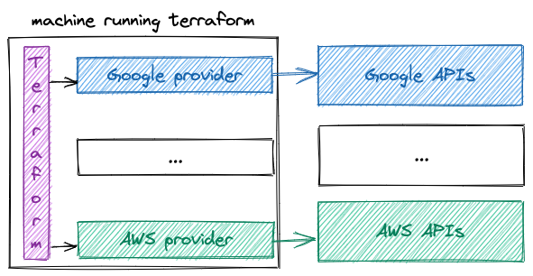

<!-- _class: lead -->

# Infrastructure as Code: Terraform

---

# Discussed topics

* Historical infrastructure provisioning 
* Cloud infrastructure provisioning
* Infrastructure as Code
* Terraform: HCL & declarative definition
* Terraform: Resources & modules
* Terraform: Providers
* Terraform: State & Terraform workflow
* Terraform: State Management

---

<!-- _class: lead -->
# Historical infrastructure provisioning 

---

> Buy, configure & operate the servers.

> Setup everything yourself.

> Plan ahead.

---

# Historical infrastructure provisioning (1/2)

In the **pre-cloud** era, companies used to own their datacenter or sometimes share it with other companies.

These companies:

* Rented or owned the **building**.
* **Bought** the servers, disks, network appliances and **every** needed piece of equipment to run their workloads.
* Employed professionals to **install, configure and maintain** these setups.

---

# Historical infrastructure provisioning (2/2)

Although this approach gives **complete control** over the infrastructure, it has a few **drawbacks** such as:

* **Getting** new equipment **takes time** (choose, buy, ship or transport, install, etc).
* **Planning** for capacity has to be done **in advance** or accept **additional costs** to avoid resources shortage.
* **Focus** on the **infrastructure** issues **instead** of the actual **business** of the company.
* **Managing** infrastructure costs is not very simple.

---

# Cloud infrastructure provisioning

> Focus on your business, let us handle the rest.

---

# Cloud infrastructure provisioning

Cloud providers came in with a few promises that challenged the old way of managing infrastructure:

* Resources are up and running **right after** being requested
* Resources can be downgraded or removed **at any time**
* **Services** are provided instead of separate resources or appliances (Kubernetes, BigQuery, Pub/Sub, etc)
* Billing analysis is provided in **real time** and const estimation on a **monthly basis** are available.
* **API** based system alongside manual setup of services through a **UI**.

---

<!-- _class: lead -->
# Infrastructure as Code 

---

> Why should you use a Version control System for your infrastrcuture ?

---

# Infrastructure as Code

Cloud infrastructure provisioning enabled **fast** and **frequent** infrastructure updates.

* **What** changed since last time ?
* **Who** made the changes ?
* **How** can we go back to a given stable state ?

---

<!-- _class: lead -->
# Terraform: HCL & declarative definition 

---

# Terraform: HCL & declarative definition

**Terraform** is one of the options for managing infrastructure as code.

**Terraform** code is writen in Hashicorp Configuration Language, with Hashicorp being the company behind products such as **Terraform** & **Vault**.

**Terraform** uses a declarative approach. Instead of focusing on how to do things (the algorithm) we state what we would like to have. **Terraform** is responible of how to create, update or delete it.

---

# Terraform: Project structure

Typical **Terraform** projects contain `.tf` files which contain source code and `.tfvars` files that contain variable values.

Typical **Terraform** projects contain the following files:

* `main.tf`: contains resources declaration.
* `variables.tf`: contains declaration of variables that can be used.
* `something.tfvars`: contains values for the variables for example `dev.tfvars`, `staging.tfvars`, etc.
* `outputs.tf`: contains outputs of the terraform that was run
* `providers.tf`: contains providers configuration.


---

<!-- _class: lead -->
# Terraform: Resources & modules 

---

# Terraform: Resources

**Resources** are used to tell **Terraform** what needs to exist.

For example, here is a resource definition for a **Google Cloud Storage**:

```hcl
resource "google_storage_bucket" "tj-bucket" {
  name          = "tj-bucket"
  location      = "EUROPE-WEST1"
}
```

---

# Terraform: Modules

**Modules** can be viewed as a group of resources definition.

**Modules** are to be used to adress some recurrent use case. 

For instance, if we suppose that an application needs a kubernetes cluster, a pub/sub and a google cloud storage, then a module called `my-app` can be created. In this way, instead of declaring each resource on its own, we would call the module.

Call to module is similar to resource declaration. Here is an example:

```hcl
module "application" {
  source = "git::ssh://git@github.com/my-repo/terraform-modules.git//app-type-1"

  app_name     = var.app_name
  app_location = var.app_location
}
```

---

<!-- _class: lead -->
# Terraform: Providers 

---

# Terraform: Providers

**Providers** are used by **Terraform** to communicate with **APIs** of the different service providers such as **GCP** or **AWS**



**Providers** can be bypassed by calling the API if you do not want to use terraform for your infrastructure as code. However, using **terraform** with **providers** is very convenient.

---

<!-- _class: lead -->
# Terraform: State & deployment cycle 

---

# Terraform: State

**Terraform** uses a **state file** to keep track of the infrastructure.

The **state file** enables **Terraform** to only apply the **delta** or **difference** between the **desired** and **current** state of the infrastructure:

* **Declared** resources that exist **in the state** will only be **modified** if their configuration has changed.
* **Declared** resources that are **not in the state** will be **created**.
* **No longer declared** resources that exist **in the state** will be **removed**.

It is **highly recommended** to store the **state file** on a **remote backend** such as a google cloud storage.

---

# Terraform: Terraform workflow

**Terraform** workflow goes as follows:

1. `terraform init`: this command **retrieves** the **state file** from the backend and **downloads** any missing **providers** or **modules**.
2. `terraform plan`: this command **first reads** the state file and tries to **refresh** the state by getting the current state of any listed resources. **Then** it shows the creations, modifications & deletion to be done.
3. `terraform apply`: this command **first applies** the changes defined by the `plan` command. **Then** it updates the **state file**.

Additional steps can be added for better control over the terraform code, such as, `terraform validate` (to be done after `init`) and `terraform fmt` which is a linter.

---

# Terraform: Terraform plan

An extract from a **Terraform** plan looks as follows:

```
provider_name_resource_name.chosen_resource_id: Refreshing state... [id=resource-id]
# other refreshes here were removed to keep the example simple

Terraform used the selected providers to generate the following execution plan. Resource actions are indicated with the
following symbols:
  + create
  ~ update in-place
  - delete

Terraform will perform the following actions:

  # provider_name_resource_name.chosen_resource_id will be created
  ~ resource "provider_name_resource_name" "chosen_resource_id" {
      id         = "resource-id"
      ~ some_list_attribute    = [
          - "value-0",
          + "value-1",
          + "value-2",
        ]
    }
  
  # other changes here were removed to keep the example simple

Plan: 1 to add, 0 to change, 0 to destroy.
```

---

<!-- _class: lead -->
# Terraform: State Management 

---
