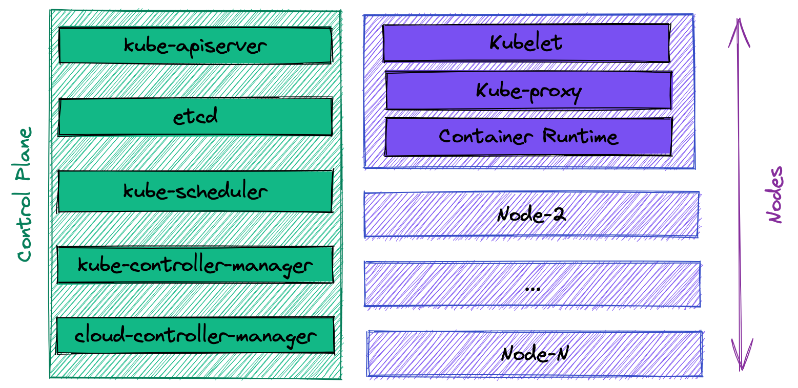
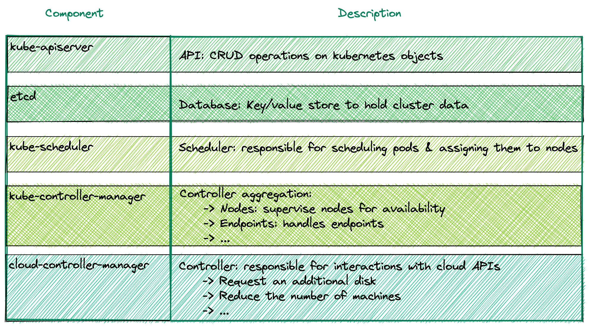

<!-- _class: lead -->

# Kubernetes basics

---

# Discussed topics

* Containers orchestration 
* Kubernetes
* Kubernetes architecture components
* Pods & deployments
* Daemonsets, Jobs & CronJobs
* Labels & filtering
* Namespaces
* Services

---

<!-- _class: lead -->
# Containers orchestration 

---

## Containers

In order to follow this presentation, basic understanding of containers and docker usage is required. 

If this kind of knowledge is missing, the reader is invited to first, check the [containers](https://github.com/Tazminia/presentations/blob/main/containers/containers.pdf) presentation before proceeding any further.

---

## Containers limits

When working with containers multiple limits can be observed:

* What happens if the host machine is unstable ?
* What happens if the containers use all of the available cpu or memory ?
* What if one container is no longer enough to handle the load ?
* What is responsible for restarting an unhealthy container ?
* What is an unhealthy container ?
* How to access a given service in a container ?
* How to define communication rules between containers ?

---

## Containers orchestration

Containers orchestration is the automated management of the operational loads related to running containers.

Examples of what this operational load includes:

* Scheduling
* Scaling
* Health monitoring
* Network access

---

<!-- _class: lead -->
# Kubernetes 

---

## Kubernetes

**Kubernetes** is the most popular container orchestration system.

**Kubernetes** is open-source & each public cloud providers offers his own managed service:

* GCP: Google Kubernetes Engine (GKE & GKE autopilot)
* AWS: Elastic Kubernetes Service (EKS)
* Microsoft Azure: Azure Kubernetes Service (AKS)

---

## Kubernetes features

Some of kubernetes basic features are:

* Running containers on a cluster (multiple machines connected by network)
* Containers health monitoring & auto recovery
* Node health monitoring & container re-scheduling
* Service discovery

---

<!-- _class: lead -->
# Kubernetes architecture

---

## Kubernetes components (1/3)

---

## Kubernetes components (2/3)

