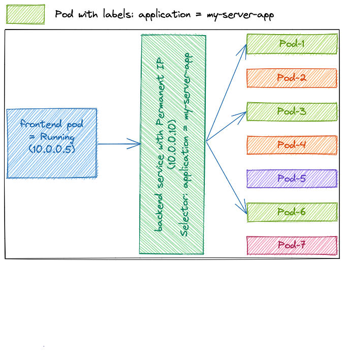

<!-- _class: lead -->

# Kubernetes basics

---

# Discussed topics

* Containers orchestration 
* Kubernetes
* Kubernetes architecture components
* Pods
* Pod basic commands
* Deployments
* Namespaces
* Labels & filtering
* Daemonsets, Jobs & CronJobs
* Services

---

<!-- _class: lead -->
# Containers orchestration 

---

## Containers

In order to follow this presentation, **basic** understanding of **containers** and docker usage is required. 

If this kind of knowledge is missing, the reader is invited to **first**, check the [containers](https://github.com/Tazminia/presentations/blob/main/containers/containers.pdf) presentation **before** proceeding any further.

---

## Containers limits

When working with containers multiple limits can be observed:

* What happens if the host machine is **unstable** ?
* What happens if the containers use **all** of the available **cpu** or **memory** ?
* Which machine is **best suited** to run the containers ?
* What if one container is no longer enough to handle the **load** ?
* What is responsible for restarting an **unhealthy** container ?
* What is an **unhealthy** container ?
* How to **access** a given service in a container ?
* How to define **communication rules** between containers ?

---

## Containers orchestration

Containers **orchestration** is the **automated** management of the **operational** loads related to running **containers**.

Examples of what this operational load includes:

* Scheduling
* Scaling
* Health monitoring
* Network access

---

<!-- _class: lead -->
# Kubernetes 

---

## Kubernetes

**Kubernetes** is the most popular container orchestration system.

**Kubernetes** is open-source & each public cloud providers offers his own managed service:

* GCP: Google Kubernetes Engine (GKE & GKE autopilot)
* AWS: Elastic Kubernetes Service (EKS)
* Microsoft Azure: Azure Kubernetes Service (AKS)

---

## Kubernetes features

Some of kubernetes basic features are:

* Running containers on a cluster (multiple machines connected by network)
* Containers health monitoring & auto recovery
* Node health monitoring & container re-scheduling
* Service discovery

---

<!-- _class: lead -->
# Kubernetes architecture

---

## Kubernetes components (1/3)


---

## Kubernetes components (2/3)


---

## Kubernetes components (3/3)


---

<!-- _class: lead -->
# Pods

---

## Pods

**Pods** are units containing one or multiple **containers**.

**Pods** are **kubernetes objects** that are created by calling the kubernetes API.

**Pods** follow the structure below:

```yaml
apiVersion: v1
kind: Pod
metadata:
  # ... ignored for now
  name: nginx # Pod name
spec:
  containers:
  - image: nginx:stable # Container image
    name: nginx # Container name
  # ... ignored for now
```

---

## Running a simple Pod

In order to run a simple **pod** we can do the following:

```console
$ cat hands-on/yaml-samples/pod.yaml
apiVersion: v1
kind: Pod
metadata:
  name: nginx-from-yaml
spec:
  containers:
  - image: nginx:stable
    name: nginx-from-yaml
$ kubectl apply -f hands-on/yaml-samples/pod.yaml
pod/nginx-from-yaml created
```

In docker, this would have been equivalent to:

```console
$ docker run -d -it nginx:stable
```

---

<!-- _class: lead -->
# Pod basic commands

---

Please proceed to **hands-on** [pod-basic-commands.md](hands-on/1-pod-basic-commands.md).

---

<!-- _class: lead -->
# Deployments

---

**Deployments** can be viewed as **managed pods**.

In order to better understand deployments, please proceed to **hands-on** [pods-vs-deployments.md](hands-on/2-pods-vs-deployments.md).

---

<!-- _class: lead -->
# Namespaces

---

```console
$ k explain namespaces
#...
Namespace provides a scope for Names. Use of multiple namespaces is optional
```

* Namespaces provide a **context** in a kubernetes environment.
* Namespaces help **isolate** objects.

---

## Use cases

* Namespaces can split a **single** physical kubernetes cluster into **multiple** logical clusters.
  * a namespace for dev and another one for staging on the same cluster.
  * a namespace for each team on a shared cluster.
* Each namespace can be **accessed** by a **different** group of **individuals** (IAM)
* Each namespace can be **assigned** a **different** set of **resources** (CPU/RAM)
* **Communication** between pods in different namespaces can be **blocked** or **enabled**.

In order to better understand namespaces, please proceed to **hands-on** [namespaces.md](hands-on/3-namespaces.md).

---

<!-- _class: lead -->
# Labels & filtering

---

## Labels

```console
$ k explain pod.metadata.labels
#...
Map of string keys and values that can be used to organize and categorize (scope and select) objects
```

* Labels can be assigned to all **kubernetes objects**
* Labels enable **filtering** kubernetes objects based on a **key** and a **value**

In order to better understand labels, please proceed to **hands-on** [labels.md](hands-on/4-labels.md).

---

<!-- _class: lead -->
# Daemonset, Job & CronJob

---

* **Daemonset**
    * Run a pod on **every node** of the cluster.
    * If a new node is **added** to the cluster, a pod is **created** on it.
    * If a node is **removed** from the cluster, the pod is **not created** elsewhere.
* **Job**:
    * Creates one or more pods and retries their execution until a specified number ends in success.
    * Can be used to create pipelines with sequential & parallel steps, depending on completion status.
    * Pods are kept until the job is deleted so that execution logs can be retrieved.
* **CronJob**: a scheduled **Job**

---

<!-- _class: lead -->
# Services

---

## Pods & IPs (1/2)

* Each **Pod** created is assigned an **ephemeral IP**
* When **restarted**, the Pod IP can **change**
* If a Pod `A` needs to access an application running in Pod `B`
    * Pod `A` can call Pod `B` through `Pod-B-IP:app-Port` for example (10.0.0.2:8080)
* What if Pod `B` is restarted & gets assigned IP 10.0.0.3 ?

---

## Pods & IPs (2/2)


---

$ k explain services
#...
Service is a named **abstraction** of software service (for example, mysql)
consisting of **local port** (for example 3306) that the proxy listens on, and
the **selector** that determines which pods will answer requests sent **through**
the **proxy**
```

---

## Services & IPs


---

## Services & Pods



---

In order to better understand services, please proceed to **hands-on** [services.md](hands-on/5-services.md).

---

## Service types

There are a few service types:

* **Cluster IP**: 
    * This is the **default** type. 
    * A **private IP** is assigned to the service and it is only **internally** in the kubernetes cluster.
* **Node Port**:
    * A **port** is allocated **on each machine** of the clusters.
    * Service is accessed through `machine-ip:allocated-port`
    * Service is accessible both internally and externally (through the machine IP)
* **Load balancer**:
    * Call an **external API** to **provision & configure** a load balancer. For example, call GCP API to create a HTTPS Load Balancer
    * Service is accessible through the load balancer's IP
    * Service is accessible both internally & externally (through the LB IP)